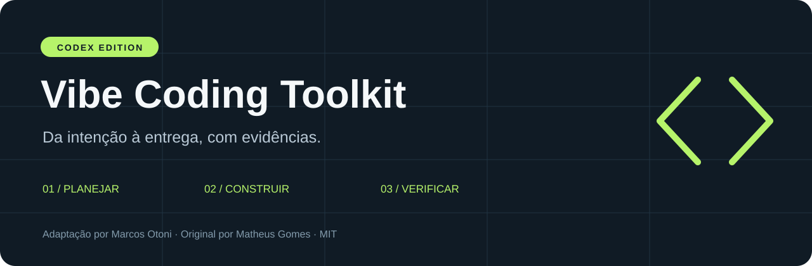
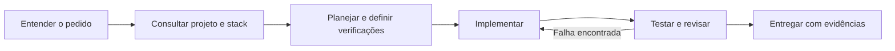

<p align="center"></p>

<p align="center">
  <a href="LICENSE"></a>
  
  
</p>

# Vibe Coding Toolkit · Codex Edition

**Um fluxo de desenvolvimento com IA que conecta planejamento, implementação e verificação.**

Esta é a adaptação para **Codex** do [Vibe Coding Toolkit de Matheus Gomes](https://github.com/soumatheusgomes/vibe-coding-toolkit), mantida por **Marcos Otoni**. Reúne uma skill portátil, instruções de projeto, nove procedimentos e regras ESLint testáveis. Você traz sua stack; o toolkit ajuda a organizar o trabalho.

[Começar](#comece-em-poucos-passos) · [Guia completo](codex/GUIA.md) · [Compatibilidade](codex/COMPATIBILIDADE.md) · [Contribuir](CONTRIBUTING.md) · [Original](README.upstream.md)

> Edição independente, sob licença MIT. Não é um produto oficial da OpenAI nem uma versão oficial do autor original. O histórico e a atribuição do projeto de origem estão preservados.

## O que você recebe

| Peça | Para que serve |
|---|---|
| **Skill `vibe-codex`** | Seleciona o procedimento adequado à tarefa, com referências carregadas conforme necessário |
| **Modelo de AGENTS.md** | Organiza diretrizes, stack, comandos, papéis e convenções do projeto |
| **Nove fluxos** | Cobrem diagnóstico, planejamento, execução, revisão e manutenção |
| **Quality gates** | Regras ESLint para tamanho de arquivo, uso direto de console e acesso ao banco pela apresentação |
| **Instalador com prévia** | Mostra o que será criado e recusa arquivos existentes com conteúdo diferente |
| **Memória externa opcional** | Reutiliza sua documentação ou Obsidian configurado, sem copiar o acervo |

## Como o trabalho acontece



Subagentes podem participar quando estiverem disponíveis e autorizados. O fluxo também funciona sequencialmente. Cada entrega distingue o que foi verificado, o que permanece pendente e o que não se aplica.

## Comece em poucos passos

**Requisitos:** Python 3.9+ para instalar. Para testar as regras ESLint desta distribuição, Node `^20.19.0 || ^22.13.0 || >=24` e npm. O toolkit não exige que seu aplicativo use essas versões ou JavaScript; os gates ESLint são específicos para projetos compatíveis.

### 1. Obtenha e conheça a distribuição

```sh
git clone https://github.com/marcosotoni82/vibe-coding-toolkit-codex.git
cd vibe-coding-toolkit-codex
```

Leia o [guia](codex/GUIA.md) e a [matriz de compatibilidade](codex/COMPATIBILIDADE.md) antes de aplicar ao seu projeto. Para uso reproduzível em equipe, fixe um commit revisado.

### 2. Confira a prévia

Substitua o caminho abaixo pela pasta **já existente** do seu projeto:

```sh
python3 scripts/install.py /caminho/do/seu-projeto
```

Por padrão, nenhum arquivo é escrito. Para aplicar:

```sh
python3 scripts/install.py /caminho/do/seu-projeto --apply
```

O resultado no destino será:

```text
seu-projeto/
├── AGENTS.md
└── .agents/skills/vibe-codex/
    ├── SKILL.md
    ├── references/       # Os nove procedimentos
    └── assets/eslint/    # Templates e verificador originais
```

**Já existe AGENTS.md?** Se o conteúdo for diferente, a instalação para antes de escrever. Integre manualmente o [modelo](codex/templates/AGENTS.md.template) às instruções atuais e copie a pasta da skill sem sobrescrever personalizações. O instalador não faz mesclagem automática.

### 3. Use no Codex

Abra o projeto no Codex e selecione a skill **vibe-codex** para seu trabalho de desenvolvimento. Ela pode ser descoberta pelo escopo do repositório. Se não aparecer, confira a pasta instalada e reinicie a sessão.

A instalação é **local ao projeto**: não altera configurações globais ou do Claude, não instala plugins nem habilita permissões. A integração dos gates com o aplicativo é uma etapa própria, orientada pelo fluxo 08.

## Os nove fluxos

| # | Procedimento | Quando usar |
|---|---|---|
| 01 | [Diagnóstico](codex/prompts/01-project-sanitation.md) | Entender um projeto existente antes de alterar |
| 02 | [Redução da dívida](codex/prompts/02-eslint-warning-burndown.md) | Corrigir warnings com medição antes/depois |
| 03 | [Revisão por lentes](codex/prompts/03-multi-agent-code-review.md) | Procurar falhas concretas e priorizar achados |
| 04 | [Da intenção ao plano](codex/prompts/04-brainstorm-to-plan.md) | Definir escopo, dependências e critérios de aceite |
| 05 | [Execução em ondas](codex/prompts/05-parallel-wave-dispatch.md) | Dividir trabalho sem disputar os mesmos arquivos |
| 06 | [Memória externa](codex/prompts/06-memory-bootstrap.md) | Consultar conhecimento canônico sem duplicá-lo |
| 07 | [Lint por stack](codex/prompts/07-eslint-complete-setup.md) | Adaptar configuração a linguagem e framework |
| 08 | [Instalação dos gates](codex/prompts/08-eslint-quality-gates-install.md) | Integrar regras preservadas e verificar seu funcionamento |
| 09 | [Refatoração por responsabilidade](codex/prompts/09-file-size-refactor.md) | Reduzir arquivos grandes preservando comportamento |

## O que foi adaptado — e os limites

- **Instruções:** AGENTS.md é a entrada do projeto para Codex.
- **Skills:** esta edição fornece uma skill própria; não inclui as skills externas do Superpowers ou da Anthropic.
- **Hooks:** configurações de hooks do Claude não são instaladas no Codex. Markdown orienta; não intercepta comandos.
- **Stack:** nenhuma tecnologia de aplicativo é imposta. Frameworks como Vue e Svelte precisam de configuração própria de lint.
- **Ferramentas:** conectores, plugins e subagentes dependem do ambiente e da autorização da sessão.
- **Memória:** Obsidian é opcional. Documentação local também funciona; não há promessa de memória permanente.

A [matriz completa](codex/COMPATIBILIDADE.md) registra equivalências e lacunas. `docs/`, `templates/` e o README original conservam o material upstream para consulta; a entrada ativa desta edição é `codex/`.

## Verificação reproduzível

```sh
python3 -m unittest discover -s tests -v
python3 scripts/check_integrity.py
npm ci --ignore-scripts
npm test
```

Os testes cobrem conflitos, prévia, repetição da instalação, symlinks e destino inválido. O manifesto verifica os assets preservados, e o RuleTester exercita as três regras ESLint. Veja o [relatório de validação](codex/VALIDACAO.md).

Essas verificações validam esta distribuição. Os testes, lint e integração do seu aplicativo ainda precisam ser executados no projeto destino.

## Contribuições e créditos

Encontrou um problema? [Abra uma issue](https://github.com/marcosotoni82/vibe-coding-toolkit-codex/issues) com reprodução e ambiente, sem credenciais ou dados privados. Consulte o [guia de contribuição](CONTRIBUTING.md).

**Original:** [Matheus Gomes](https://github.com/soumatheusgomes) · **Adaptação Codex:** [Marcos Otoni](https://github.com/marcosotoni82).

Licença [MIT](LICENSE). Consulte a [proveniência](codex/PROVENIENCIA.md) para identificar a versão de origem e os arquivos adaptados.

---

**English:** A community-maintained Codex adaptation of Matheus Gomes' Vibe Coding Toolkit. Includes project instructions, a portable skill, nine development workflows, a non-overwriting installer, and tested ESLint rules. Documentation is currently in Portuguese. No Claude configuration is changed and no external plugins are installed automatically.
